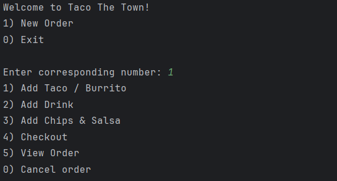
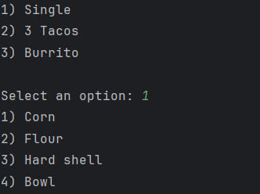
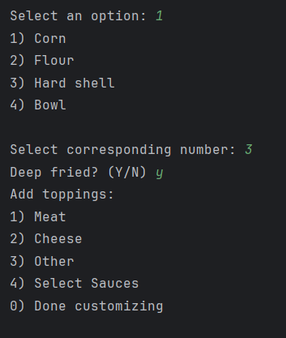
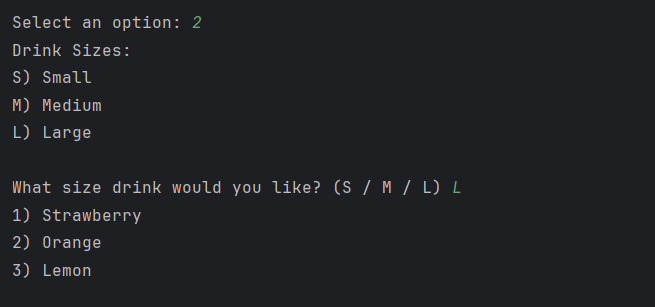
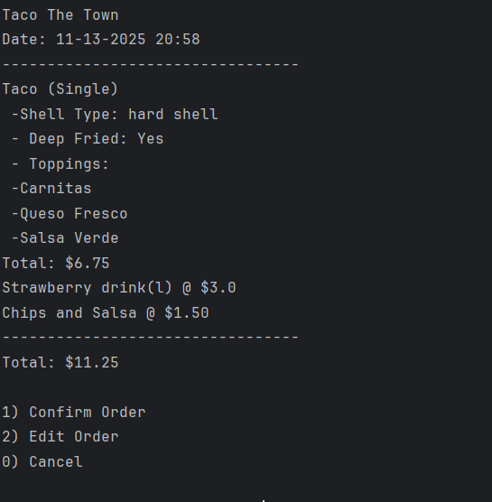
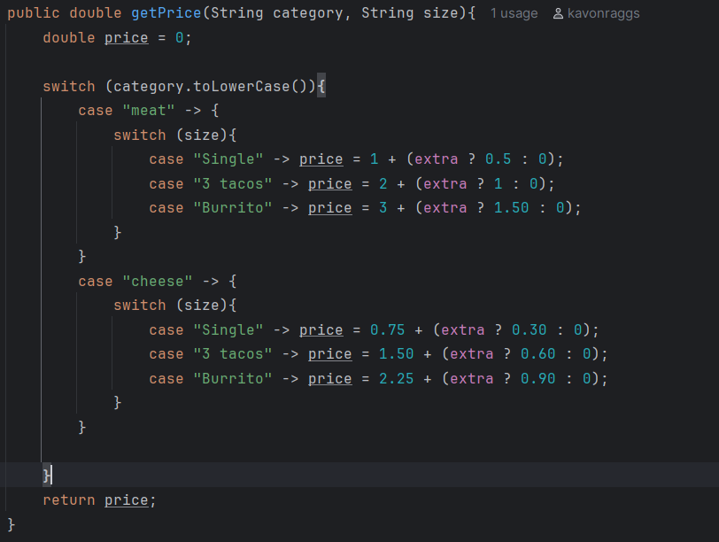

# Taco The Town
Console-based POS application for Taco The Town Taco Shop built using Java

# Author
Name: Kavon Raggs

## Features
- Tacos / Burritos : Pick size, shell, toppings, and if deep-fried
- Drinks : Pick size and flavor
- Chips and salsa : Can be added as side item
- Receipt : Receipts generated (Time stamped and itemized)

## Screens
- Main Menu:

- Shell Menu

- Toppings

- Drink

- Checkout

## Interesting Code

 Nested switch statement
- Switch for category: meat or cheese
- Switch for size
- Ternary Operator (short if-else statement ) for Extra